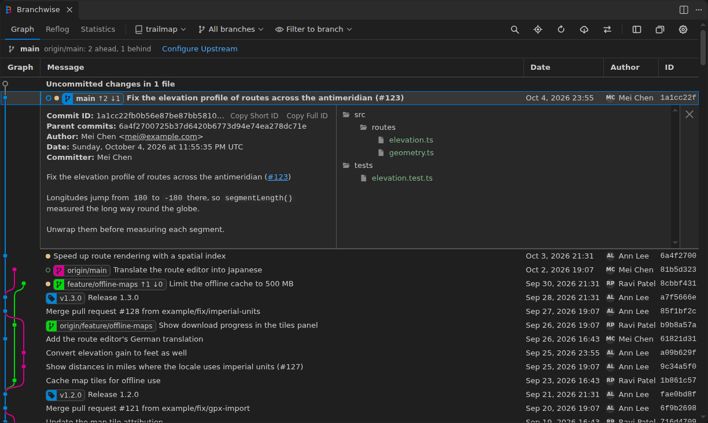
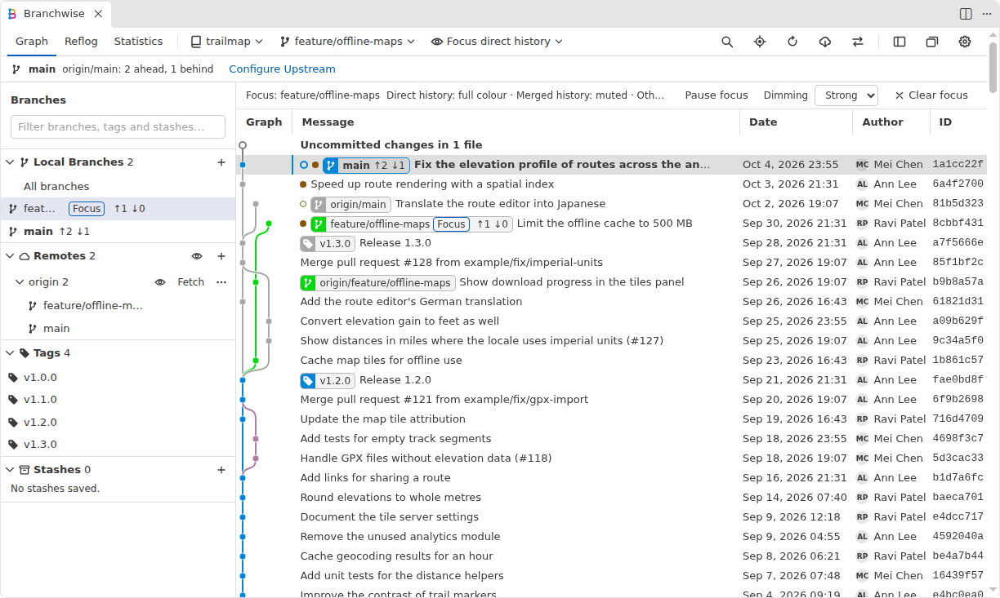
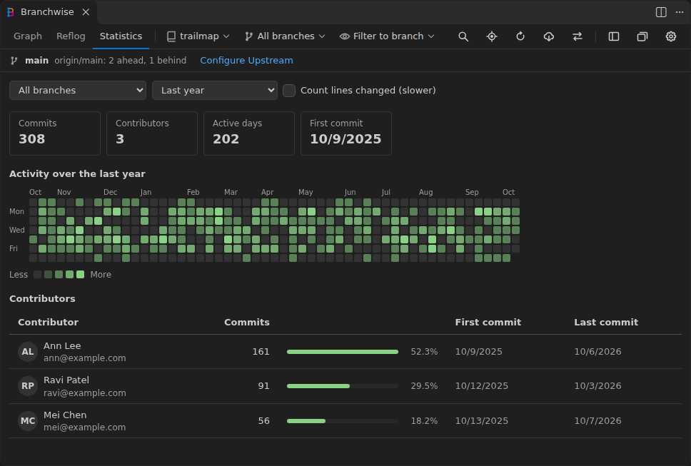

  
  <h1>Branchwise</h1>
  
<strong>A visual Git graph for VS Code.</strong> 
  Read your history, focus on one branch, and run everyday Git without leaving the graph.

  

    
    
    
    
  

## Install

Search for **Branchwise** in VSCodium or another Open VSX editor, or run
`codium --install-extension jcfurey.branchwise`. For Visual Studio Code, download
the `.vsix` from [Open VSX](https://open-vsx.org/extension/jcfurey/branchwise) and choose
**Extensions → ⋯ → Install from VSIX…**. Branchwise needs VS Code 1.125 or newer, or an editor
based on it, and Git.

Open the graph from the Branchwise button in Source Control, the status bar, or
**Branchwise: View Graph (git log)**. The **Get started with Branchwise** walkthrough shows the
basics.

## Features

**Read your history**

- One graph of branches, tags, remotes, stashes and uncommitted changes
- Commit details with formatted messages, linked issues, a file tree and per-file diffs
- Search by message, ID, author, committer, branch, tag, date or path, or for the commits that added or removed a piece of text
- Go to any branch, tag or commit from the keyboard, or open it on GitHub or GitLab
- Dots and rings mark unpushed and unpulled commits
- A mark on each branch that would conflict if merged into yours, naming the files

**Focus**

- Branch focus dims unrelated history, without a checkout
- Hide bot branches such as `dependabot/*` and `renovate/*` by name pattern
- Hide remotes one at a time; [view choices](docs/preferences.md) are kept per repository
- Pin branches to the top, list them by latest commit, and spot merged, stale and gone ones

**Work from the graph**

- Branches and tags: create, check out, rename, merge, delete, push
- Commits: check out, cherry-pick, revert, reset, fixup; cherry-pick or revert several in order
- Plain and interactive rebase; push and pull previews; force-push only with a lease
- Fast-forward every branch that is only behind its upstream, without a checkout
- Stashes, conflict resolution, and continue, skip or abort for interrupted operations
- Single keys on the focused commit, such as B to create a branch; `?` lists every shortcut

**Recover and investigate**

- Reflog tab that recovers commits no branch reaches; compare refs; restore earlier file contents
- Guided bisect, merged-branch cleanup, and a Statistics tab of commits and contributors

**Repositories**

- Multi-repository workspaces with submodules, nested repositories, remotes and worktrees
- Remote - SSH, WSL, Dev Containers and Codespaces; English, Simplified and Traditional Chinese

The [user guide](docs/git-actions.md) describes every action.

## Settings

All settings start with `branchwise.`.

| Setting                       | Default         | Description                                                  |
| ----------------------------- | --------------- | ------------------------------------------------------------ |
| `autoCenterCommitDetailsView` | `true`          | Centre an opened commit's details vertically                 |
| `dateFormat`                  | `"Date & Time"` | Show dates as `"Date & Time"`, `"Date Only"` or `"Relative"` |
| `dateType`                    | `"Author Date"` | Show each commit's `"Author Date"` or `"Commit Date"`        |
| `graphColours`                | 12 colours      | Colours of the graph's lanes, in order                       |
| `graphStyle`                  | `"rounded"`     | Lines that change lanes: `"rounded"` or `"angular"`          |
| `initialLoadCommits`          | `300`           | Commits first loaded for a repository or branch              |
| `loadMoreCommits`             | `100`           | Commits added by **Load Older Commits**                      |
| `maxDepthOfRepoSearch`        | `0`             | Folder depth searched for repositories                       |
| `nestedRepoSearchDepth`       | `3`             | Folder depth searched inside each repository for nested ones |
| `showCurrentBranchByDefault`  | `false`         | Open showing only the checked-out branch                     |
| `showUncommittedChanges`      | `true`          | Show the uncommitted changes row                             |
| `singleKeyShortcuts`          | `true`          | Let single keys act on the focused commit row                |
| `tabIconColourTheme`          | `"colour"`      | Graph tab icon in `"colour"` or `"grey"`                     |

## Upgrading from (neo) Git Graph

Branchwise was called (neo) Git Graph and installed as `jcfurey.neo-git-graph`. Uninstall that
extension, or `asispts.neo-git-graph`, so that Source Control shows one graph button. On first
start, Branchwise copies your `neo-git-graph.` settings to `branchwise.`, keeping any you have
already set under the new name.

## Contributing

Report bugs and request features in [Issues](https://github.com/jcfurey/Branchwise/issues). See
[Contributing](CONTRIBUTING.md) to build, test or change Branchwise, and the
[changelog](CHANGELOG.md) for each release.

## Origins and license

Branchwise is released under the [Apache License 2.0](LICENSE). It began as a fork of
[asispts/neo-git-graph](https://github.com/asispts/neo-git-graph), which continued mhutchie's
[Git Graph](https://github.com/mhutchie/vscode-git-graph) from its last MIT-licensed commit; no
code from later, differently licensed Git Graph releases is included. All code inherited from
both projects has since been replaced; earlier versions that still contained it were released
under the MIT License with both projects' notices. Branchwise is not affiliated
with or endorsed by either project. [Provenance](docs/provenance.md) records the lineage, the
licenses at each stage, and how the inherited code was replaced.
